<!-- 1. Matrix Animation Overlay -->

  

 

<!-- 2. Profil-Beschreibung -->

  <h3>Full-Stack Web Developer & Systems Architect</h3>
  
Bridging the gap between scalable web applications and hardened infrastructure.

  

    <b>Core Infrastructure:</b> Proxmox • pfSense • Reverse Proxies • Load Balancing 
    <b>Defensive Security:</b> Zero Trust Architecture • MFA • TLS/SSL • CA Management 
    <b>Academic Path:</b> B.Sc. Information & Cyber Security (Starting Sep 2026)
  

 

<!-- 3. Tech Stack Icons (Über Devicons CDN für garantierte Verfügbarkeit) -->

  
  
  
  

 

<!-- Dynamic GitHub Stats -->

  

 

<!-- Most Used Languages -->

  

 

<!-- GitHub Streak -->

  

