<!-- Matrix Hero Banner -->

  

 

  <h2>Infrastructure-minded Full-Stack Developer</h2>
  

    Building web applications, automation tools, and self-hosted infrastructure with a growing focus on cybersecurity and cloud security.
  

  

    <b>Full-Stack:</b> JavaScript • Vue.js • PHP • Laravel • MySQL • Docker 
    <b>Infrastructure:</b> Linux • Proxmox • pfSense • WireGuard • Reverse Proxies • TLS/SSL 
    <b>Automation & AI:</b> Python • OpenAI/Gemini APIs • Ollama • Structured Data Pipelines 
    <b>Security Focus:</b> Zero Trust • Network Segmentation • MFA • Internal CA • Incident Response 
    <b>Academic Path:</b> B.Sc. Information & Cyber Security, HSLU — starting Sep 2026
  

 

---

## About Me

I am a full-stack web developer with a strong interest in infrastructure, automation, and cybersecurity.

My work combines web development with practical systems engineering: Dockerized applications, Linux servers, Proxmox-based homelab environments, pfSense firewalling, WireGuard VPNs, reverse proxies, TLS/SSL, and internal certificate authority management.

Currently, I am building AI-assisted automation tools, including an e-commerce listing assistant that transforms product photos and structured item data into researched listing drafts.

I am preparing for a B.Sc. in Information & Cyber Security at HSLU, with a long-term focus on cloud security, incident response, and secure infrastructure design.

---

## Current Focus

- Building a professional full-stack portfolio
- Developing an AI-assisted e-commerce listing assistant
- Expanding a Proxmox/pfSense homelab for security and infrastructure labs
- Learning cloud security fundamentals
- Preparing for B.Sc. Information & Cyber Security at HSLU

---

## Project Highlights

### Ricardo AI Listing Assistant

AI-assisted workflow for generating structured product listings from photos, measurements, and minimal item data.

**Focus:** prompt engineering, image-based analysis, pricing research, structured outputs, and automation.

---

### ZeroTrust MiniCorp Homelab

A simulated small-business infrastructure using Proxmox, pfSense, VLANs, WireGuard, reverse proxies, internal CA, and segmented services.

**Focus:** network security, defensive architecture, TLS, and practical infrastructure hardening.

---

### Self-hosted AI Chatbot

Local LLM chatbot experiment using Ollama and a custom web interface.

**Focus:** self-hosted AI, API integration, frontend UX, and controlled local inference.

---

### GitLab CI/CD Deployment Lab

Hands-on CI/CD pipeline for testing and deploying applications to self-managed infrastructure.

**Focus:** GitLab runners, deployment automation, Docker, and server-side release workflows.

---

## Tech Stack

  
  
  
  
  
  
  
  
  
  
  
  

 

---

## GitHub Stats

  

 

  

