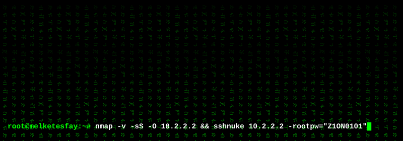
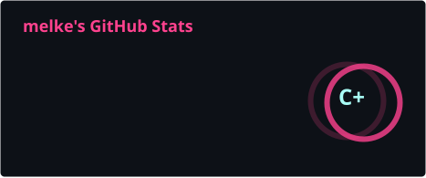
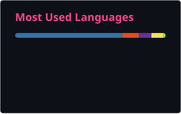

<!-- Matrix Hero Banner -->

  

 

  <h2>Full-Stack Developer focused on infrastructure, automation and security</h2>
  

    I build web applications, AI-assisted automation tools and self-hosted systems.
    My main interests are backend logic, DevOps workflows, practical cybersecurity and infrastructure that is operated, not just demoed.
  

  

    <a href="https://melke.ch">
      
      <b>Portfolio</b>
    </a>
    &nbsp;•&nbsp;
    <a href="https://github.com/melketesfay">GitHub</a>
    &nbsp;•&nbsp;
    <a href="https://codepen.io/melketesfay">CodePen</a>
    &nbsp;•&nbsp;
    <a href="https://infosec.exchange/@melketesfay">Mastodon</a>
  

  

    <b>Web:</b> HTML • CSS • JavaScript • Vue.js • PHP • Laravel • MySQL 
    <b>Automation & AI:</b> Python • Playwright • Vertex AI/Gemini • OpenAI APIs • Ollama • RAG 
    <b>Infrastructure:</b> Linux • Docker • Proxmox • pfSense • TrueNAS • GitLab CI/CD • Reverse Proxies 
    <b>Security & Networking:</b> Zero Trust • Network Segmentation • WireGuard • TLS/SSL • MFA • Internal CA • Monitoring 
    <b>Cloud & IaC:</b> Terraform • Google Cloud Platform • Firebase • GitHub Actions
  

 

---

## About Me

I am a full-stack developer with a strong interest in the systems around the application: backend logic, deployment, authentication, monitoring, network boundaries and automation.

My work combines web development with practical infrastructure engineering. I run and expand self-hosted environments with Linux, Docker, Proxmox, pfSense, reverse proxies, WireGuard, internal TLS and segmented services. I am especially interested in how web applications behave once they leave the local machine and become real systems that need to be deployed, secured and operated.

Currently, I am building AI-assisted automation tools and infrastructure labs while preparing for a deeper academic path in cybersecurity.

**Academic path:** Mechanical Engineering studies at ETH Zürich, successfully completed the first-year examination; part-time B.Sc. Information & Cyber Security at HSLU from September 2026.

---

## Current Focus

- Building **ARKI**, an AI-assisted catalog automation workflow with Python, Playwright, Vertex AI/Gemini and RAG-style context.
- Expanding a **Zero-Trust MiniCorp Homelab** with Proxmox, pfSense, segmented services, auth, monitoring and self-hosted deployment flows.
- Designing **Terraform & GCP infrastructure blueprints** for reproducible, reviewable cloud environments.
- Improving my practical understanding of identity, MFA, internal certificate authorities, network segmentation and observability.
- Preparing for part-time cybersecurity studies at HSLU from September 2026.

---

## Project Highlights

### ARKI - AI Catalog Automation

Product-catalog automation for Brocki Arche Zürich. The workflow analyzes product photos, gathers research context through Google Lens/SerpAPI, and generates listing drafts with Vertex AI/Gemini, tool calling and RAG-style project context.

**Focus:** Python, Playwright, browser automation, AI-assisted research, structured outputs and workflow acceleration.

---

### Rest Assured AFH - Frontend & Brand Project

Frontend and branding project covering web design, logo work, business cards, brochure/banner assets, SEO and performance polish. The deployment is built around a very low-cost hosting setup using GitHub Actions and Firebase.

**Focus:** frontend implementation, visual design, branding, SEO, performance and deployment.

---

### Zero-Trust MiniCorp Homelab

A self-hosted infrastructure lab modeled like a small organization: Proxmox virtualization, pfSense firewalling, segmented networks, reverse proxy, internal CA, auth, storage, GitLab CI/CD and monitoring.

**Focus:** system architecture, network segmentation, TLS, defensive infrastructure and operational learning.

---

### Terraform & GCP Infrastructure Blueprint

Infrastructure-as-Code project for reproducible cloud environments on Google Cloud Platform. The goal is to manage networking, IAM, hosting foundations, state handling and CI/CD-driven changes without manual console drift.

**Focus:** Terraform, GCP, IAM, cloud networking, reproducible environments and reviewable infrastructure changes.

---

### Custom Portfolio Interface

My portfolio website is a zero-framework frontend system built with HTML, CSS and Vanilla JavaScript. It includes wave navigation, touch reveals, a 3D cube, CRT layers, responsive motion fallbacks and performance polish.

**Focus:** browser-native frontend, interaction design, DOM work, responsive motion and performance tradeoffs.

---

### Identity & MFA Lab

Security learning project for understanding authentication, session handling and two-factor flows by building a web auth system together with an Android authenticator app.

**Focus:** authentication, 2FA/MFA, sessions, backend security concepts and Android integration.

---

## Tech Stack

  
  
  
  
  
  
  
  
  
  
  
  
  
  
  
  
  
  
  

---

## GitHub Stats

  

 

  

